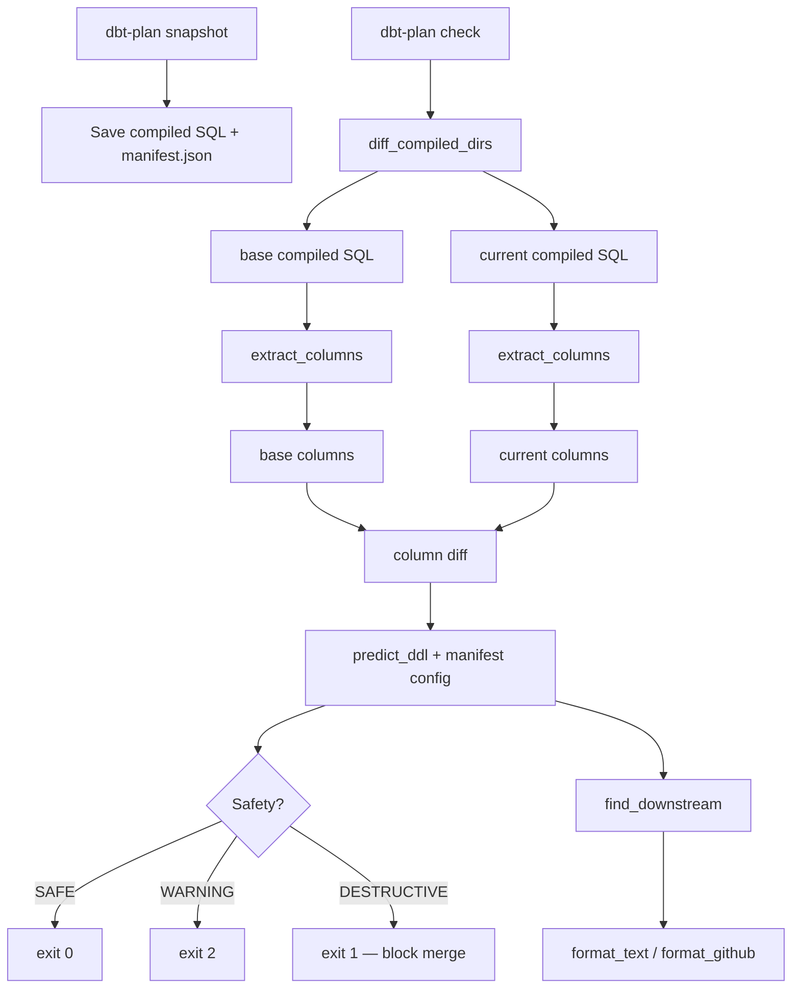

# dbt-plan

Static analysis tool that warns about risky DDL changes before `dbt run`.

Like `terraform plan` for dbt. Runs on compiled SQL — you need a `dbt compile` (which connects), but from there dbt-plan works on files alone. Works with any warehouse (Snowflake, BigQuery, Redshift, Postgres, etc.).

## What It Looks Like

```
$ dbt-plan check

dbt-plan -- 2 model(s) changed

DESTRUCTIVE  int_order_enriched (incremental, sync_all_columns)
  DROP COLUMN  shipping_info
  DROP COLUMN  billing_info
  ADD COLUMN   shipping_city
  Downstream: dim_customers, fct_orders (2 model(s))
  >> BROKEN_REF  fct_orders: references dropped column(s): shipping_info

SAFE  dim_customers (table)
  CREATE OR REPLACE TABLE

dbt-plan: 2 checked, 1 safe, 0 warning, 1 destructive, 1 cascade risk(s)
```

## What It Does

dbt-plan analyzes compiled SQL diffs to catch dangerous schema changes at PR time:

- **Column changes**: detects ADD/DROP COLUMN from SQL diff
- **Risk assessment**: judges safety based on materialization x on_schema_change rules
- **Cascade analysis**: finds downstream models that reference dropped columns
- **Config changes**: detects materialization or on_schema_change policy changes
- **Type changes**: compares explicit `CAST` types between revisions
- **`SELECT *` resolution**: reads the columns from the CTEs of the same statement, and follows a `ref()` into the referenced model's compiled SQL

It does NOT execute anything, connect to any warehouse, or simulate `dbt run`. It reads files, compares them, and warns you.

## Quick Start

```bash
pip install dbt-plan

# In your dbt project directory:
dbt-plan run               # One command: compile baseline → compile current → check
```

That's it. `dbt-plan run` handles `dbt compile`, snapshotting, and checking automatically — so it needs whatever credentials your `dbt compile` normally needs. If you can't compile locally, run it in CI (see below) and dbt-plan reads the artifacts there.

### More commands

```bash
dbt-plan init              # Generate .dbt-plan.yml config + update .gitignore
dbt-plan stats             # Analyze project readiness
dbt-plan ci-setup          # Generate GitHub Actions workflow
dbt-plan agent-setup       # Write AGENTS.md so coding agents know to run the check
dbt-plan check --format github   # GitHub markdown output
dbt-plan check --format json     # JSON for CI pipelines
dbt-plan check --select model1   # Check specific model only
```


## Scope

dbt-plan is a **static analysis warning tool**, not a runtime simulator.

| In scope | Out of scope |
|----------|-------------|
| Column ADD/DROP detection from compiled SQL | `dbt run` simulation |
| materialization × on_schema_change risk rules | Warehouse connection |
| Cascade broken ref / build failure analysis | `seed` / `source` change detection |
| Config change detection (materialization, osc) | `pre_hook` / `post_hook` DDL analysis |
| Explicit `CAST` type changes | Type changes on uncast columns |
| `SELECT *` resolved through CTEs and `ref()` | `SELECT *` over a source or a raw table |
| CI exit codes + structured output | `full_refresh` mode judgment |

**Design principle**: false warnings are OK, false safe is never OK.

## When to use it

dbt-plan answers a narrower question than the warehouse-connected tools (Recce,
SQLMesh, data-diff) and costs nothing to run, so it works as the cheap gate in
front of them — including on fork pull requests, where they cannot run at all.
See [use cases](docs/use-cases.md) for the comparison, real timings, and what it
gets wrong.

## Deliberately Not Planned

Ideas that look useful but contradict what this tool is:

| Idea | Why not |
|------|---------|
| INFORMATION_SCHEMA query | Requires a warehouse connection. dbt-plan reads files and nothing else — that is what makes it safe to run anywhere, including on a fork's PR. |
| Type changes on columns with no explicit `CAST` | The type is whatever the warehouse assigned, so seeing a change would mean asking it. Columns that *are* cast explicitly on both sides are compared — see below. |

## DDL Prediction Rules

| Materialization | on_schema_change | Predicted DDL | Safety |
|-----------------|------------------|---------------|--------|
| table | any | `CREATE OR REPLACE TABLE` | SAFE |
| view | any | `CREATE OR REPLACE VIEW` | SAFE |
| ephemeral | any | (no physical object) | SAFE |
| snapshot | any | `REVIEW REQUIRED` | WARNING |
| incremental | ignore | no DDL | SAFE |
| incremental | fail | build failure | WARNING |
| incremental | append_new_columns | `ADD COLUMN` only | SAFE |
| incremental | sync_all_columns | `ADD + DROP COLUMN` | DESTRUCTIVE if columns removed |
| any | (model removed) | `MODEL REMOVED` | DESTRUCTIVE |
| any | (unknown osc) | `UNKNOWN on_schema_change` | WARNING |

## CI Integration (GitHub Actions)

```yaml
name: dbt-plan
on:
  pull_request:
    paths: ['models/**', 'macros/**', 'dbt_project.yml']

jobs:
  plan:
    runs-on: ubuntu-latest
    permissions:
      contents: read
    env:
      # Whatever your profiles.yml reads. `dbt compile` connects; dbt-plan does not.
      SNOWFLAKE_ACCOUNT: ${{ secrets.SNOWFLAKE_ACCOUNT }}
      SNOWFLAKE_USER: ${{ secrets.SNOWFLAKE_USER }}
      SNOWFLAKE_PRIVATE_KEY: ${{ secrets.SNOWFLAKE_PRIVATE_KEY }}
    steps:
      - uses: actions/checkout@v4
        with:
          fetch-depth: 0          # the base revision has to be in the clone
          persist-credentials: false
      - uses: actions/setup-python@v5
        with: { python-version: '3.12' }
      - run: pip install uv && uv sync

      - uses: PresentJay/dbt-plan@v1
```

Keep the `pull_request` trigger. Never switch it to `pull_request_target` — `dbt compile`
runs Jinja and macros written in the pull request, so that would hand your warehouse
credentials to code from any fork.

| Input | Default | |
|---|---|---|
| `compile-command` | `dbt compile` | Runs twice, once per revision. |
| `base-ref` | the PR base | The revision to compare against. |
| `project-dir` | `.` | dbt project directory. |
| `dialect` | `snowflake` | sqlglot dialect for parsing compiled SQL. |
| `version` | latest | Pin a dbt-plan release. |
| `fail-on` | `destructive` | Or `warning`, or `never`. |
| `summary` | `true` | Write the report to the job step summary. |

Outputs `verdict` (`safe` / `destructive` / `warning`), `exit-code`, and `report`
(path to the JSON report), so a later step can comment on the PR or open a ticket.

For a workflow you own outright rather than a wrapped action, `dbt-plan ci-setup`
generates one with the credential wiring and least-privilege notes inline. Details in
[docs/ci-integration.md](docs/ci-integration.md).

## How It Works



## Contributing

See [CONTRIBUTING.md](CONTRIBUTING.md) for development setup, TDD workflow, and coding rules.

### Architecture

```
src/dbt_plan/
├── columns.py      # SQLGlot column extraction (multi-dialect)
├── config.py       # .dbt-plan.yml + env var configuration
├── predictor.py    # DDL risk assessment rules + cascade analysis
├── manifest.py     # manifest.json parsing + downstream BFS
├── diff.py         # compiled SQL directory comparison
├── formatter.py    # text / GitHub markdown / JSON output
└── cli.py          # CLI: snapshot, check, init, stats, run, ci-setup
```

### How to Contribute

**Good first issues:**
- Add compiled SQL fixtures in `tests/fixtures/` for edge cases (UNION, subqueries, etc.)
- Improve error messages for common mistakes

**Medium issues:**
- `ddl-reviewed` label override — escape hatch for intentional destructive changes
- INFORMATION_SCHEMA integration — query warehouse for SELECT * resolution

**Design decisions:** See [docs/design-notes.md](docs/design-notes.md).

## Supported

- dbt-core 1.7+, and the dbt Fusion engine (verified against `2.0.0-preview.218`)
- Any warehouse: Snowflake, BigQuery, Redshift, Postgres, DuckDB, etc. (`--dialect`)
- Python 3.10+
- CTE, UNION ALL, QUALIFY, window functions, VARIANT access

## License

Apache-2.0
